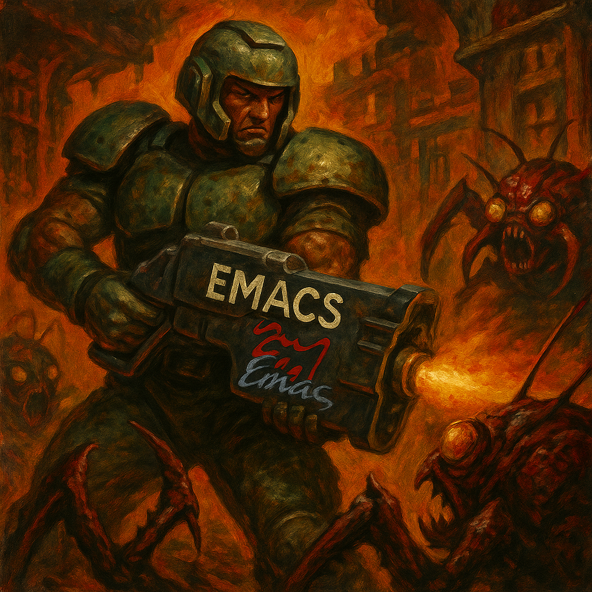

  

My name is Wassim and I'm a software developer based in Sète, France.

I’ve worked on so many tech stacks during my professional career, both backend and frontend/mobile; but I like to program in Swift inside my trusty Doom Emacs window.

My work days are split in two halves: one doing my freelancing gigs as a software engineer, the other is building my own apps, currently building Autographe–a Mac modal text editor for Swift hackers.

I find my happiness in programming without AI assistance, this is why I consider myself as a generative AI VEGETARIAN.

## What I do
- Indie app development
- Consulting: Swift development.

## I ♥
Spending time with my family, reading, practice writing, walking, running.

## Values
I’m a Muslim and I believe in software that empowers users and respects their privacy and autonomy. That’s one of the reasons why I’m building my presence outside of data-harvesting platforms.
